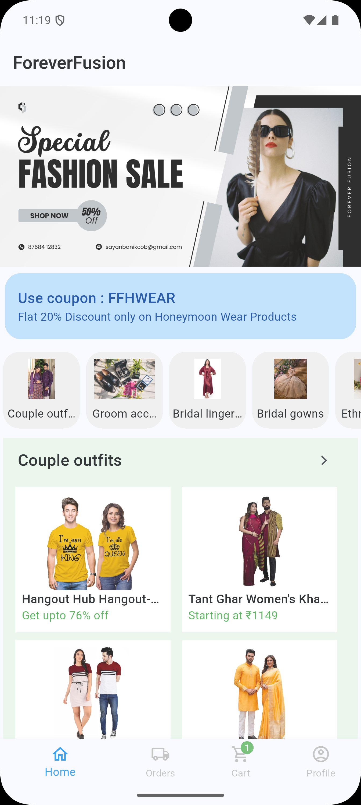
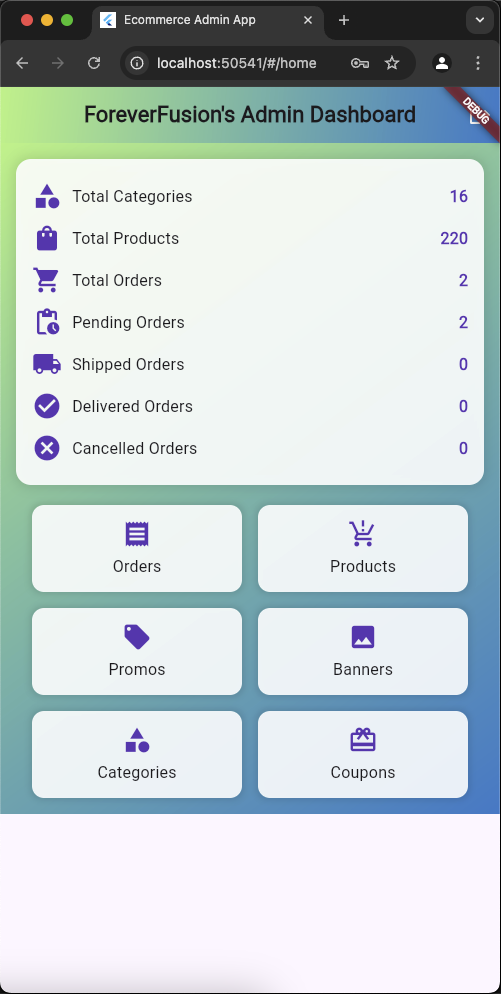

# ForeverFusion

## About ForeverFusion
ForeverFusion is a modern e-commerce platform designed to provide a seamless shopping experience for wedding essentials. The platform consists of:
- **Main App** – A user-friendly shopping experience with categories like bridal gowns, jewelry, and footwear.
- **Admin Panel** – A powerful dashboard for managing products, orders, customer interactions.

This project was developed as part of a **Final Year College Project**.

---

## Features

### **Main App:**
- **Product Catalog** – Browse wedding essentials including Bridal Gowns, Jewelry, and Footwear.
- **User Authentication** – Secure signup and login using Firebase Authentication.
- **Shopping Cart & Checkout** – Add items to cart and place orders seamlessly.
- **Order Tracking** – Track order status in real time.

### **Admin Panel:**
- **Product Management** – Add, edit, and delete products.
- **Category Management** – Organize products into relevant wedding categories.
- **Order Management** – Process and track customer orders.
- **Admin Dashboard** – View analytics and sales reports.

---

## Screenshots

### **Main App**

### **Admin Panel**

---

### **Prerequisites**
Before running this project, ensure you have the following installed:
- [Flutter SDK](https://flutter.dev/docs/get-started/install) (Latest Version)
- [Android Studio](https://developer.android.com/studio) / [Xcode](https://developer.apple.com/xcode/)
- Firebase Project Setup
